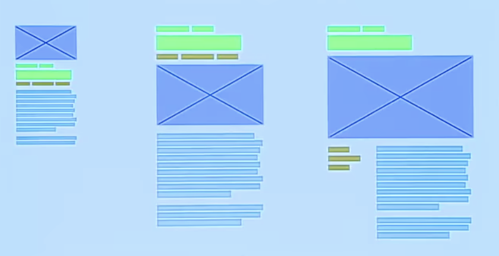

# CSS Grid

## A practical approach for today

1. Build accessible mobile-first layout without grid
2. Use mobile-first layout as fallback for all browsers
3. Use @supports to detect grid support
4. At the appropriate breakpoint, create layout with grid and grid-areas
5. Explore new layouts as viewport widens

## Exercice

Let's implement the following layout :

## Extra ressources 

- Use Firefox Grid Inspector for development 
- https://gridbyexample.com